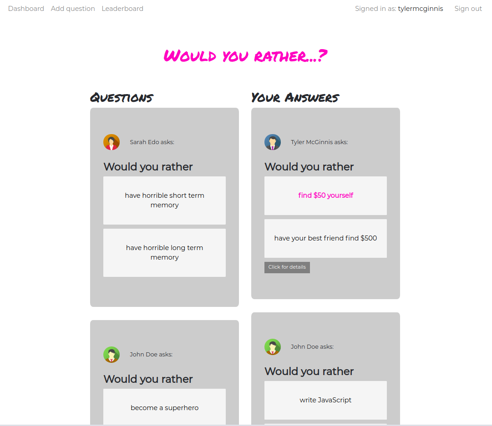

# Would-you-rather

This is a Would-you-rather game app made with React and Redux. The app allows the user to add a question and then vote on questions that they and other users added. When voted the user sees what percentage of users voted the same as them.

### Installing

To install the project:
    
    npm install

### Running

To start the project:

    npm start
    
Here is the screenshot of the first page, where existing user can log in.

And this is the dashboard with both unanswered and answered questions.

This project was bootstrapped with [Create React App](https://github.com/facebook/create-react-app).

